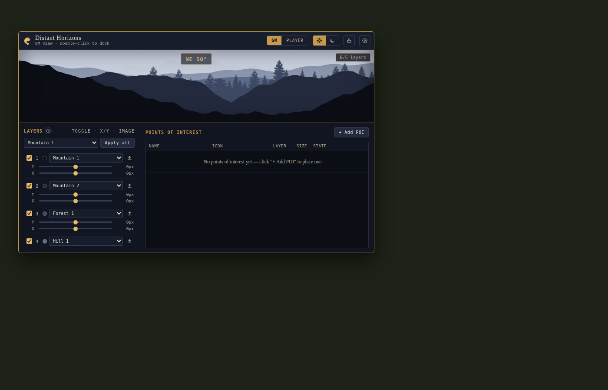

# Shrimp's Distant Horizons

A floating, draggable **parallax horizon** window for Foundry VTT scenes, with layered
depth terrain and a table of draggable Points of Interest (towers, mines, caves, ruins...)
that GMs can place on the horizon and reveal to players over time.



## Status — v1.0.1

The window, layer controls, POI table, day/night toggle, GM/Player view, compact docking,
and custom-image layer uploads all work as tested — and as of v1.0.0, the horizon/POI setup
you build is actually **saved and synced**, not just a local-browser prototype anymore (see
below).

**Compatibility: Foundry v13+.** This module targets Foundry's current (v13) UI going
forward; v11/v12 are no longer the design target (see v0.1.2 below for why that matters).

**v0.1.1** fixed the docked (compact) window spanning the full width of the screen and
passing behind the hotbar, sidebar and any popped-out windows. It measures Foundry's real
scene-controls column, sidebar and hotbar and docks the strip between them, sitting above
the hotbar and **centred**, with equal breathing room on both sides for other modules' own
toolbar buttons or panels.

It also added:
- **Free Dock** (Settings → Docking) — drag the docked strip to any position on your own
  screen instead of the auto-centred spot, using the small handle above it. This is a
  per-browser preference (a client-scoped Foundry setting), not shared with other players.
- A **resizable window** — drag the bottom-right corner while undocked to grow it; it
  won't shrink smaller than its shipped default size.

**v0.1.2** fixes the docked strip collapsing to zero width and snapping to the dead centre
of the screen on **Foundry v13**. v13 substantially restructured the UI landmarks v0.1.1's
centred-docking measurement relied on: `#ui-left` is no longer the narrow toolbar itself
but a much wider layout wrapper (scene controls + scene navigation columns), and `#sidebar`
collapses to zero width until a tab is expanded (the visible strip becomes a child element
instead). Trusting those landmark elements' own bounding boxes — which is what v11/v12
required — wildly overshot on v13, collapsing the available width to nothing. The fix
measures the actual *visible children* of those landmarks instead of the landmarks
themselves, which tracks whatever is really painted on screen on any Foundry version.

**v0.1.3** fixes docking after resizing the window. Dragging the resize handle
sets an explicit `width`/`height` directly on the window; docking never cleared
that leftover size, so the "docked" strip stayed pinned at whatever size it had
last been resized to — a tall box sitting mid-screen — instead of collapsing to
its intended slim bottom-hugging strip. Docking now clears the inline size (and
restores it automatically if you undock again), so a resize survives a dock/undock
cycle without leaking into the docked layout.

**v1.0.0** adds the two things that were missing to make this a real, usable module rather
than a local-browser prototype: **your setup now survives reloading Foundry, and it's
actually shared with your players.**

- **Saved per scene.** The horizon's terrain layers, POIs, palette, horizon length, day/night
  state and view lock are saved on the scene the moment you (the GM) change them. Reload
  Foundry, close and reopen the world, switch away and back to the scene — it's all still
  there. Each scene keeps its own horizon, which fits a multi-leg journey where you're
  swapping scenes as the party travels.
- **Live GM → player sync.** The moment the GM changes something — moves or adds a POI,
  edits a layer, flips day/night — every connected player sees it too, no refresh needed.
  A player who joins partway through the session sees whatever the GM has already set up,
  immediately. This uses Foundry's own scene-sync mechanism (the same thing that keeps
  everyone's view of tokens and lighting in sync) rather than a separate custom connection,
  so it's as reliable as the rest of Foundry.
- **Palette sync, with room for a player's own taste.** The GM's colour palette pushes to
  everyone as the starting look — including a player joining partway through. After that,
  a player is free to pick a different palette for themselves without it being overwritten
  by the GM's *other* changes (a POI move, a layer edit, and so on never touch palette).
  Only the GM's *next* deliberate palette change takes over for everyone again.
- Only an actual GM account can save or push changes, and (as of v1.0.1) only an actual GM
  account can even *see* the editing panels in the first place — see the v1.0.1 entry below.
- **Stays per-browser, unchanged:** Free Dock and window position/size, and cosmetic display
  prefs (compass mode/opacity, drag hint, full-colour icons). Those are personal display
  choices, not part of the shared horizon. The GM/Player preview toggle itself is GM-only
  as of v1.0.1 (see below) — it's a way for the GM to preview a player's screen, not a
  personal display choice a player picks for themselves.

**What ships pre-populated vs. blank (on a scene with no saved setup yet):**
- The 6 horizon **layers** come with sensible default terrain (a mix of mountains, forest
  and hills) so there's something to look at immediately — edit, reorder, or replace any
  of them from the Layers panel.
- **Points of Interest start empty.** POIs are scenario-specific, so nothing is placed for
  you — use "+ Add POI" to place your own.

**v1.0.1** — a security fix, a full audit against the project's Foundry module-dev
reference doc, and the two structural follow-ups that audit called for: a real
ApplicationV2 port and full `game.i18n` localization. No new user-facing features.

- **Fixed: real players got GM access.** Every client (GM or player) booted the exact same
  injected window with the "GM view" state on by default and nothing checking the real
  Foundry permission, so an actual player's own client showed the full Layers/POI editing
  panel — add/edit/delete POIs, edit terrain layers, and every GM-only settings section —
  from the moment they opened it, with nothing stopping them from using it. (Their edits were
  never *persisted* — `game.user.isGM` already gated every save/push — but the controls
  themselves were fully visible and clickable, and the GM/Player titlebar toggle that was
  supposed to be a GM-only "preview what a player sees" tool could be freely flipped back to
  "GM" by anyone.) Fixed at the source: an actual player's client is now hard-locked into
  Player view straight from `game.user.isGM`, and the GM/Player toggle and Lock View button
  are removed from a real player's window entirely rather than merely hidden by a client-side
  state a player could flip back.
- **Fixed: CSS was leaking onto the rest of Foundry.** Several rules were unscoped globals —
  `*{box-sizing:border-box}`, a `body{...}` block setting `overflow:hidden`, a dark
  background and a serif `font-family` on the real page body, and bare `select`/
  `input[type=range]`/`table` selectors that restyled every dropdown, slider and table in
  Foundry's own core UI and every other installed module's windows, not just this one. This
  was a leftover from the module's original artifact-preview page (which legitimately owned
  the whole page it ran in) that was never cleaned up when it was ported into the real
  module. Every rule is now scoped under the module's own injected root
  (`#shrimp-distant-horizons-root`) instead of `:root`/`html`/`body`, per the CSS-namespacing
  guidance in the project's Foundry module-dev reference.
- **Ported to ApplicationV2 + HandlebarsApplicationMixin.** The window is no longer
  hand-rolled DOM injection — it's a proper Foundry `ApplicationV2` subclass with
  Handlebars templates (`templates/window.hbs`, `settings.hbs`, `layers-info.hbs`, and two
  registered partials for layer/POI rows), `static PARTS`/`static DEFAULT_OPTIONS`, and
  `data-action` handlers instead of hand-wired DOM listeners. This is more than a
  refactor: the GM-only editing panels (`#controls`, the GM/Player toggle, Lock View, and
  every `.gm-only` settings section) are now gated with `{{#if isGM}}`/
  `{{#if showGmControls}}` in the templates themselves, so on a real player's client that
  markup doesn't exist in the rendered DOM at all — a step beyond the v1.0.1 fix above,
  which hid it with logic but still built it. Window lifecycle (position memory,
  minimize/restore, the singleton show/hide toggle from the scene-controls button) now
  rides Foundry's own `ApplicationV2` machinery rather than bespoke tracking code.
- **Fully localized via `game.i18n`.** Every user-facing string — window title, subtitle,
  panel headings, button labels and titles, table headers, settings labels, empty-state
  text — now resolves through `game.i18n.localize()`/`.format()` against
  `lang/en.json` (declared in `module.json`'s new `"languages"` field), instead of being
  hardcoded in English in the script. A translator can add another language by dropping in
  a new `lang/<code>.json` with the same keys and registering it in `module.json` — no
  script changes needed.
  
**v1.0.2** — fixes the scene-control button not opening the window at all, found
right after v1.0.1 shipped the ApplicationV2 port. Two separate bugs, both in the
new code:

- **Fixed: the toolbar button did nothing.** The scene-control tool was declared
  with both `toggle: true` and `button: true`, and its handler was named `onClick`.
  Foundry v13's core `SceneControls` only ever calls a tool's `onChange(event, active)`
  — never `onClick` — and it normalizes a tool that sets both `toggle` and `button`
  down to toggle-only. So the click was recognized (the button visibly lit up) but
  nothing was ever invoked. Renamed the handler to `onChange` and dropped the
  redundant `button: true`.
- **Fixed: opening the window threw and silently failed.** Once the click handler
  above is actually reached, the app's constructor set `this.state = {...}` to hold
  its own view/UI state (view mode, palette, compass settings, and so on) — but
  Foundry's `ApplicationV2` base class already defines `state` as a getter-only
  property (its own internal render-lifecycle enum), so assigning to `this.state`
  throws `TypeError: Cannot set property state of #<ApplicationV2> which has only
  a getter` the instant a window is constructed. Renamed the app's own state object
  to `this.uiState` everywhere in the file (`poi.state`, the separate per-POI
  discovery-state field, was untouched — that one was never the problem).
- Both were introduced by the v1.0.1 ApplicationV2 rewrite and missed because the
  mocked test harness used to verify that port stubbed a bare `ApplicationV2` without
  its real getter-only `state` property, and stubbed the scene-control click path
  as a direct function call rather than through Foundry's actual `SceneControls`
  tool-dispatch logic — so neither bug could show up there. This round was verified
  against the real, running Foundry instance instead: reproduced both failures live
  (confirmed via the tool's own definition and a constructor-level exception with a
  full stack trace), then confirmed the fix opens the window correctly.

## Project structure

```
shrimps-distant-horizons/
├── module.json              Foundry module manifest
├── scripts/
│   └── distant-horizons.js  ApplicationV2 app class + hooks (esmodule)
├── templates/
│   ├── window.hbs           Main window PART
│   ├── settings.hbs         Settings dropdown PART
│   ├── layers-info.hbs      Layers-info popup PART
│   ├── layer-row.hbs        Registered partial (one terrain layer row)
│   └── poi-row.hbs          Registered partial (one POI table row)
├── lang/
│   └── en.json               Localization strings (game.i18n)
├── styles/
│   └── distant-horizons.css
├── assets/
│   ├── shrimp-logo.png
│   ├── forest-hand-1.png
│   └── forest-hand-2.png
├── docs/
│   └── screenshot.png
├── LICENSE
└── README.md
```
